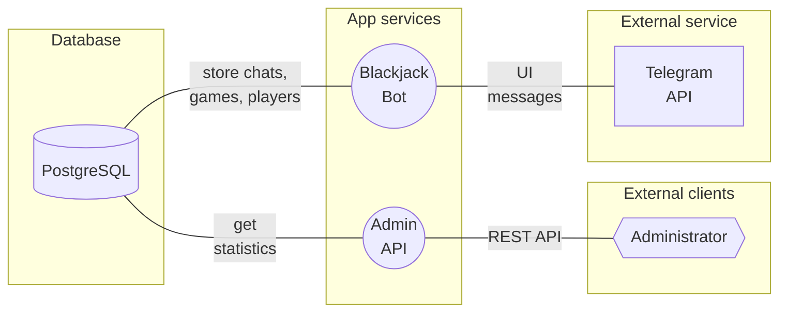
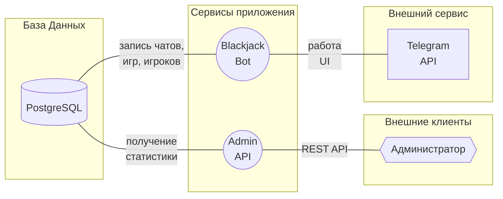

# BJBot - Blackjack Telegram Bot

## What is it?
**BJBot** - bot for Telegram, which invites to play Blackjack.

## What is inside?
### Application workflow schema

---
_Artyom **nGragas** Kornikov. Project for KTS Python Async Backend._

---
# BJBot - Blackjack Telegram Bot

## Что это?
**BJBot** - бот для Telegram, который предложит сыграть в Blackjack.

## Как устроен внутри?
### Схема работы приложения

---
_Артем **nGragas** Корников. Учебный проект для KTS Backend._
