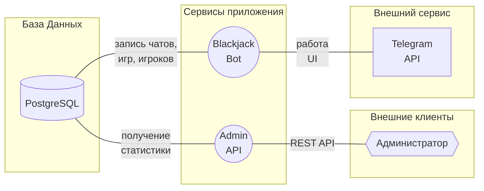

# BJBot - Blackjack Telegram Bot

## Что это?
**BJBot** - бот для Telegram, который предложит сыграть в Blackjack.

## Как им пользоваться?

## Как устроен внутри?
### Схема работы приложения

## Как запустить самостоятельно?

### Локальный запуск

### Запуск в Docker Compose

---
_Артем **nGragas** Корников. Учебный проект для KTS Backend._
